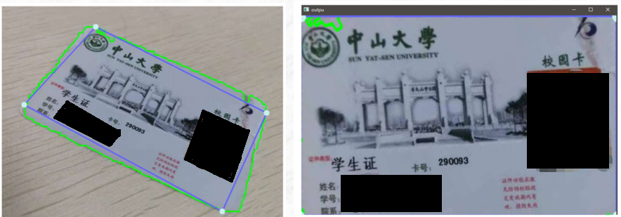
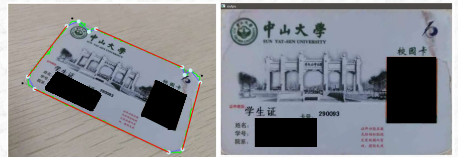
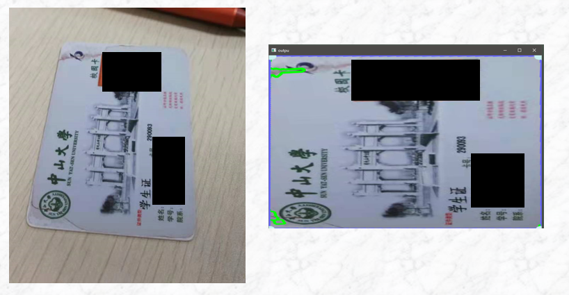
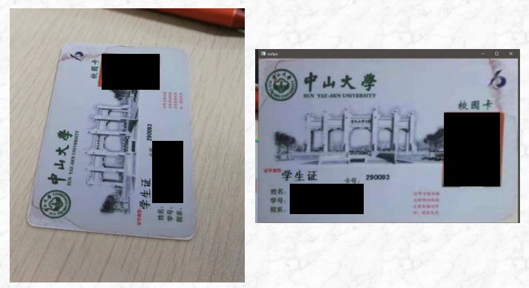

# 校园卡定位矫正项目

## 介绍
这是基于多边形拟合算法的非规则矩形卡片定位矫正系统：现有的许多矩形卡片提取系统大多需要卡片四个顶点的定位,但是这种方法会因为卡片为圆角设计不存在顶点、或是卡片边缘磨损而识别失败。对此,本人设计了一种能够定位矫正圆角、不规则四边形卡片的识别系统。系统首先利用卡片的特征进行粗定位,并使用多边形拟合算法粗定位区域,然后找到多边形拟合中最长的四条边,利用平面几何的方法求出卡片的顶点坐标,最后根据顶点坐标建立方位映射关系对图像进行透视矫正。该系统算法简单有效,处理速度相比起深度学习算法更快,图像处理速度约为35ms

## 最终效果

  

## 运行方式

在代码中修改视频名

运行 **main.py**

## 优点

### 1、多边形拟合卡片，对破损/圆角卡片也能识别
校园卡为圆角，真正的顶点并不在校园卡轮廓上，直接从圆角上提取四个顶点，矫正的效果不佳，存在明显变形(白色抹去个人信息)

  

先用多边形拟合，找出长度最长的四条边，用平面几何方法计算四条边的交点，根据交点的相对位置判断它们如何映射到矫正后的图片中。可以看到，这样做的矫正结果观感更好

  

### 2、透视矫正，任意角度都能正确提取校园卡

如果不作处理默认校园卡竖着摆放导致矫正错误

  

对多边形拟合的四条边进行排序，保证长宽边被正确映射。

  

